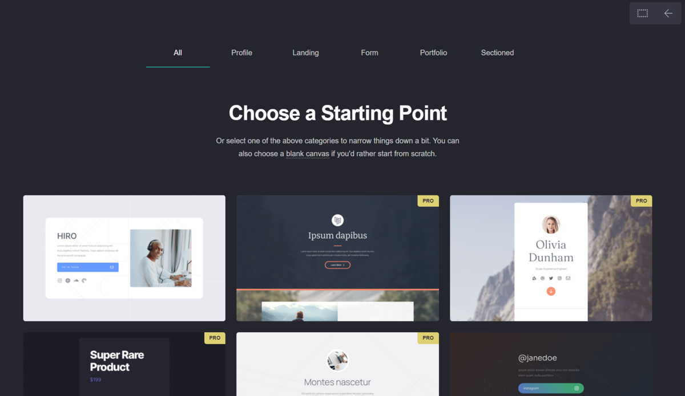

+++
title = "Erste Webseite für Blumenladen erstellt"
date = "2021-08-24"
draft = false
pinned = false
image = "hkfjhsfkjhsafkh.png"
description = "Erste Erfahrung mit einer Webseite (mit Carrd.com) erstellen und designen. "
+++
Für mich war es das erste Mal, dass ich eine Webseite erstelle. \
In einem zweier Team erstellten wir für einen fiktiven Blumenladen eine Webseite mit Carrd.com.\
Wir schossen Fotos von Blumen, die wir in der Umgebung fanden und luden diese auf die Webseite hoch. \
Uns ging es vor allem darum, dass wir auch ein bisschen austesten, was alles möglich ist. Mir machte das designen der Webseite sehr viel Spass, durch das spielen mit den Farben. Dazu auch, dass ich verschiedene Sachen austesten konnte. Interessant fand ich, wie man auf einen Knopf klicken konnte, um auf einer bestimmten Seite oder Abschnitt hinkomme, dies war ein bisschen komplexer, als die Gestaltung selbst. 

Unsere erste Webseite: [petite fleur (petit-fleur.carrd.co)](https://petit-fleur.carrd.co/)

