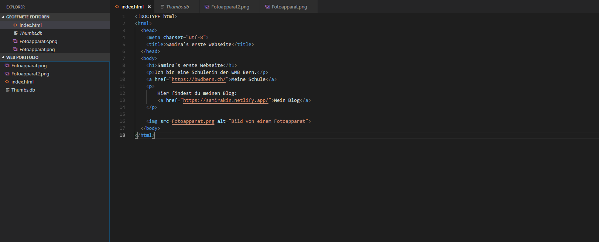

+++
title = "Erste Webseite programmiert"
date = "2021-10-19"
draft = false
pinned = false
image = "programmieren2.png"
description = "Heute habe ich das erste mal eine Webseite programmiert. "
+++
Heute haben wir im Web Unterricht das Programmieren einer Webseite unter die Lupe genommen. 

Auf [Teil 1: Unsere erste Webseite | HTML & CSS Tutorial (Deutsch) | code.makery.ch](https://code.makery.ch/de/library/html-css/part1/) gibt es eine Anleitung, welche beim Programmieren hilft. Mit Hilfe dieser Anleitung konnte ich meine erste Webseite programmieren und dann über Netlify online aufgeschaltet. Durch kleine Tipp-Fehler oder vergessen eines Hochkommas, kann es schnell zu Problemen kommen. Die Webseite wurde nur durch HTML programmiert und wird dann noch durch CSS verbessert, da dies für die Gestaltung der Webseite wichtig ist. Ich habe ein Bild verlinkt, sowie Links auf meiner Webseite aufgeführt. Ausserdem machte ich einen Titel, sowie kleinen Text, weil man diese unterschiedlich programmiert. 

Meine selbst programmierte Webseite heisst: [Samira's erste Webseite (misweb.netlify.app)](https://misweb.netlify.app/)

