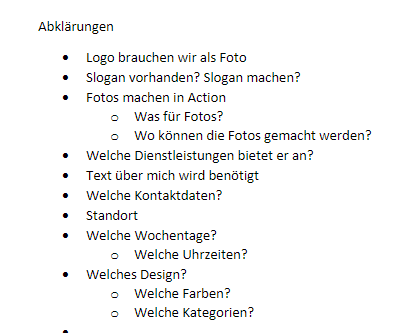

+++
title = "Fragen zur Abklärung"
date = "2021-09-21"
draft = false
pinned = false
image = "abklärung.png"
description = "Wir haben uns auf das erste Gespräch vorbereitet mit dem Kunden, indem wir die wichtigsten Abklärungspunkte festgehalten haben. "
+++
Heute haben wir die PowerPoint Vorlage fertig gestellt. \
Durch die Vorlage auf PowerPoint haben wir gemerkt, welche Informationen uns noch fehlen und was wir noch alles abklären müssen. Für die Abklärungen zu treffen, werden wir das Gespräch suchen mit unserem Kunden. \
Als Vorbereitung zum Gespräch haben wir alle zu besprechenden Punkte festgehalten. Wie wir bereits beim Mindmap überlegt haben, wollen wir den Kunden fragen, ob bereits ein Slogan besteht oder ob wir einen Entwerfen sollen. Zur Gestaltung der Webseite ist uns auch sehr wichtig, dass wir das Logo als Bild haben. Wir haben uns dazu entschieden, dass wir beim Gespräch gleich mit dem Kunden die Textzeilen verfassen wollen, welche dann auf der Homepage erscheinen. Wichtig sind auch Informationen wie; Welche Öffnungszeiten hat er?, Wo ist der Standort? und Wie will er erreicht werden. Unsere weiteren Überlegungen könnt ihr unten sehen.  

