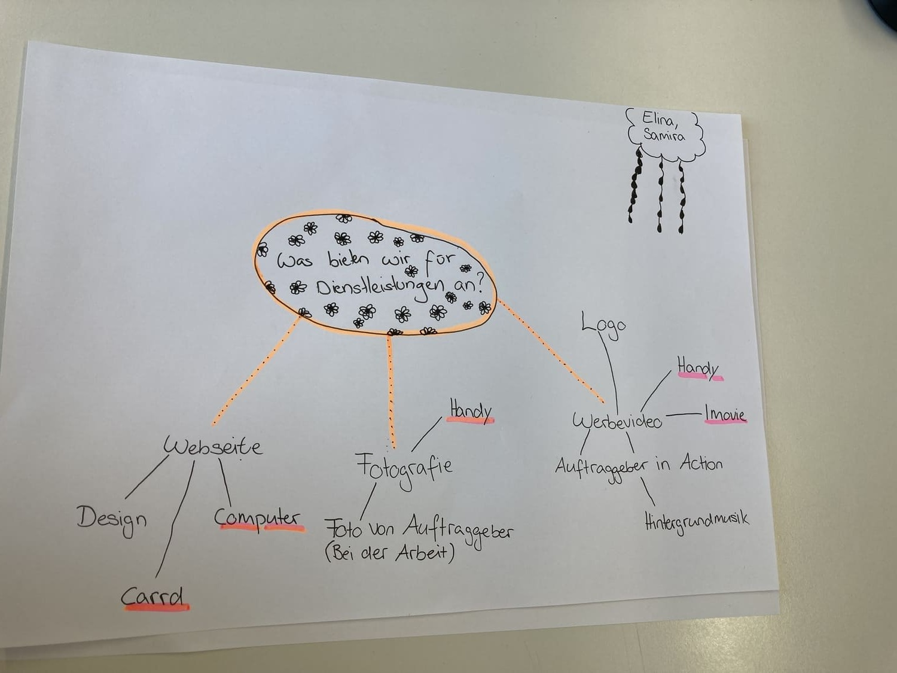

+++
title = "Ideen Entwicklung / Planung für unser erstes Projekt"
date = "2021-08-31"
draft = false
pinned = false
image = "giphy.gif"
description = "Meine Projektpartnerin und ich haben unseren ersten Auftraggeber ergattern können. "
+++
Heute habe ich mit meiner Projektpartnerin, ein Mindmap erstellt um zu schauen, welche Dienstleistungen wir anbieten können. Wir haben bereits eine Auftragsgeber mit einem Elektroniker Geschäft ergattern können. Für ihn entwerfen wir eine Webseite für seine Dienstleistungen als selbstständigen Elektroniker. Er ist sehr offen, was das Design der Homepage betrifft, was uns viel Spielraum gibt. Wir haben  die wichtigsten Vorkehrungen getroffen, wie: Recherche bei den Konkurrenten, die wichtigsten Inhalte die wir brauchen, erste Überlegungen zum Design. Ausserdem besprachen wir, welche Informationen wir von unserem Auftraggeber brauchen, wie zum Beispiel: ob er ein Slogan besitzt. Bei einem Treffen mit dem Auftraggeber sollen diese Punkte besprochen werden und wir wollen ihm unsere Ideen zeigen, die wir für die Homepage haben. Nach diesem Treffen, sollten wir die meisten Informationen und Wünsche des Auftraggebers erfasst haben und können mit der weiteren Planung los legen. Es kann gut sein, dass wir beim Gespräch noch mehr Dienstleistungen zur Verfügung stellen, wie zum Beispiel einen Slogan entwickeln, falls er keinen Besitzt. Bei dem Gespräch werden wir ein Protokoll führen, um seine Wünsche und Entscheide fest zu halten. Die ersten Entscheidungen, die keinen Einfluss auf den Auftraggeber haben, sind bei uns bereits getroffen worden. Wir haben entschieden, dass wir die Webseite mit Carrd erstellen wollen, da wir damit schon Erfahrungen gemacht haben. Mit Carrd können wir unser Wissen vertiefen, aber auch Zeit sparen, durch das bereits vorhandene Wissen, um uns danach auch noch anderen Projekten widmen können. 

