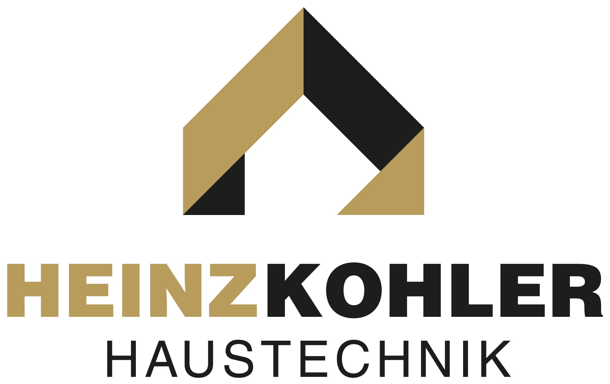
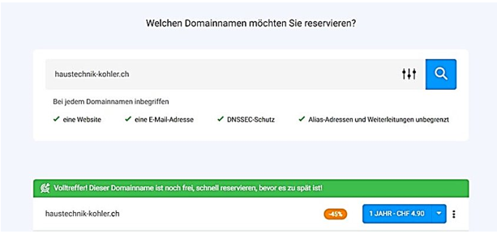
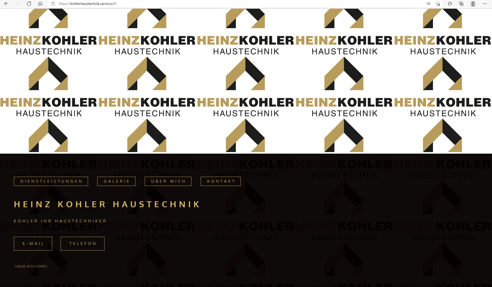

+++
title = "Projektbericht: Webseite Kohler Haustechnik"
date = "2022-01-11"
draft = false
pinned = false
image = "webseite.png"
description = "Hier findest du einen kleinen Bericht über unser Projekt; das erste mal für einen Kunden eine Webseite zu erstellen. Wir haben unsere Schritte von der Idee bis zu unserer fertigen Webseite festgehalten. Am Ende haben wir noch einen kleines Fazit und ein paar Tipps festgehalten mit Hilfe von unseren gesammelten Erfahrungen. "
+++
### Unser Projekt

**Idee** \
Ein Projekt mit einem Kunden. Eine Dienstleistung erbringen klingt nach einer grossen Herausforderung, die wir sehr gerne angenommen haben. Aber was kann man als Dienstleistung verknüpft mit unserem Wissen anbieten? 

Für uns war schnell klar, dass wir gerne eine Webseite erstellen und designen möchten. Also haben wir uns sofort auf die Suche nach einem potenziellen Kunden gemacht. Durch unsere Mund-zu-Mund-Propaganda haben wir schnell ein Kunde gefunden: Heinz Kohler Haustechnik.  

**Recherche und Planung** \
Der Erste Schritt war es, Recherchen zu betreiben. Dabei haben wir auf verschiedenen Elektrounternehmenswebseiten herumgestöbert. So konnten wir uns einen ersten Einblick verschaffen und mit dem Brainstorming beginnen. Doch nicht nur die Recherchen haben uns geholfen, zusätzlich haben wir uns Gedanken gemacht, was wir selbst für Ansprüche als Kunden haben. Nach unseren Recherchen entschieden wir uns für einige Kategorien, die wir als sinnvoll eingestuft haben. Wie beispielsweise: Über mich, Dienstleistungen, Kontakt und so weiter. Anschliessend haben wir uns durch einen Telefonanruf bei Heinz Kohler gemeldet und einen Termin abgemacht, um ihm unsere Vorschläge zu präsentieren und seine Wünsche anzuhören. Beim Telefonat konnten wir glücklicherweise schon einige Fragen stellen, die uns sehr weitergeholfen haben. Er hatte noch keinen Slogan. Also gab er uns den Auftrag bis zum Termin einen zu kreieren, was wir natürlich sehr gerne gemacht haben. Nun konnten wir planen mit welchem Hilfsmittel wir unser Projekt umsetzten möchten. Dies ging sehr schnell, denn wir waren uns einig die Webseite mit Carrd zu machen. Da wir bereits gute Erfahrungen mit Carrd gemacht haben (Webseite für einen Blumenladen), fanden wir dies einen gute Möglichkeit. Schau doch gerne bei unserem vorherigem Blogeintrag vorbei. 

**Vorbereitung** \
Vorbereitung ist das WE und B ;) bei einem Projekt, so auch bei unserem. Wir haben uns lange Gedanken gemacht, wie wir uns am besten auf den bevorstehenden Termin vorbereiten können. Wir haben nicht nur ein Word Dokument erstellt mit allen Fragen und Informationen, die wir brauchten, wir haben auch eine PowerPoint Präsentation erstellt. Die PP hatte den Zweck, das wir auf den Folien eine provisorische Webseite gestalten konnten, um diese anschliessend Heinz Kohler zu präsentieren. Für Menschen, die nicht so Technikaffin sind, ist dies eine gute Möglichkeit, um die Webseite zu veranschaulichen. Dazu haben wir auch bereits einen Blogeintrag verfasst, dort ist dies noch mit Bildern veranschaulicht. Als die PowerPoint Folien fertig waren, trafen wir noch letzte Vorbereitungen für ein Gespräch mit Herr Kohler. 

**Unser Gespräch/Planung** \
Unser erstes Gespräch, mit unserem Kunden, lief sehr gut. Durch die PowerPoint Vorlage konnte er einen Einblick erhalten, wie das ganze Aussehen könnte und hat auch gleich den Wunsch geäussert, dass er ein wenig von dem Gelb des Logos in der Webseite haben möchte. Die Fragen, die wir noch abklären wollten, haben wir ihm gestellt und auch gleich seine Wünsche protokollartig notiert. Das Logo hatte er uns per E-Mail zugestellt, damit wir dies auch gleich auf der Webseite einbringen konnten. Danach haben wir ihm die Slogans vorgestellt, die wir uns ausgedacht hatten. Einer dieser Slogans kam bei ihm sehr gut an, es war der eher schlichtere: Kohler Ihr Haustechniker. Durch das Gespräch konnten wir viele neue Informationen sammeln und waren somit einen deutlichen Schritt weitergekommen, um das Projekt umzusetzen.  

Hier ein Einblick in die fertige Webseite: 

Hier der Link zur Webseite: \
[Kohler Haustechnik](https://kohlerhaustechnik.carrd.co/#)