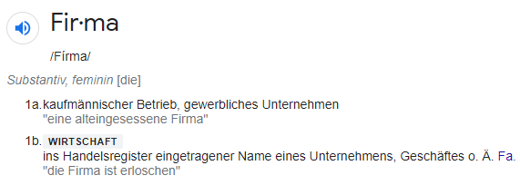
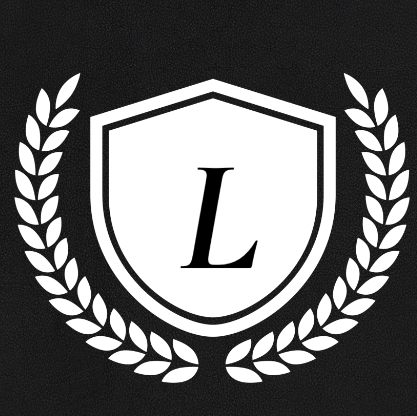
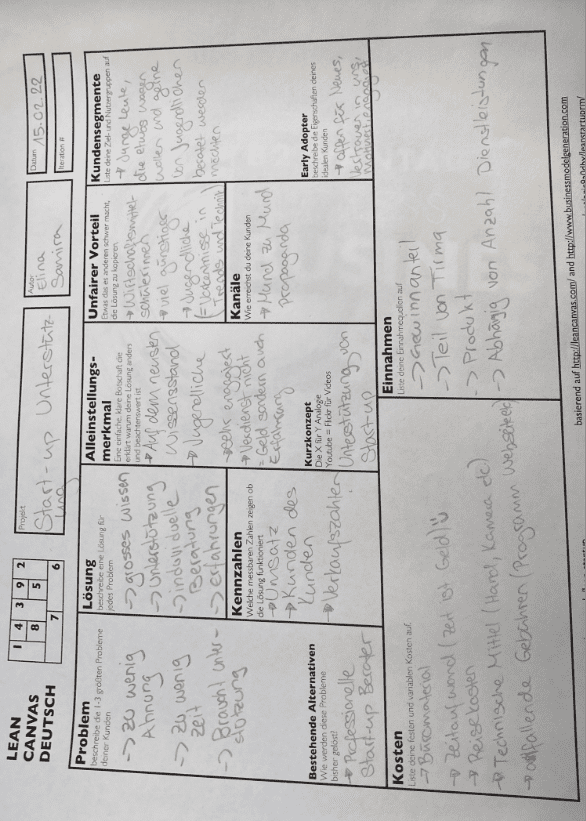
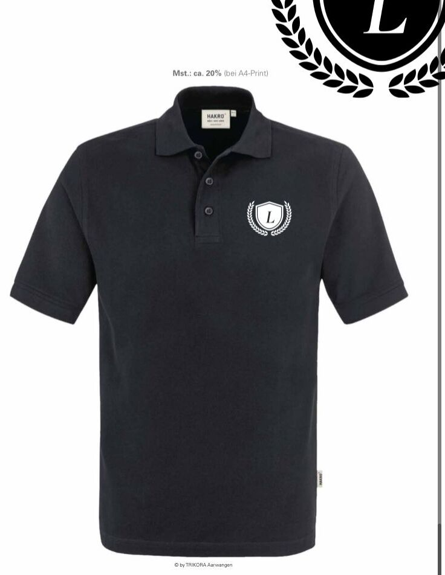

+++
title = "Unterstützung von Start-up Libertà"
date = "2022-03-01"
draft = false
pinned = false
image = "ich-liebe-siepng.png"
description = "Ein Bekannter möchte gerne seine eigene Modemarke gründen und Kleidungsstücke verkaufen. Er selbst hat aber keine Erfahrung mit einem Start-up und ist überfordert mit den Planungsschritten. Durch ein Gespräch haben wir festgestellt, dass wir ihn bei den ersten Schritten unterstützen können."
+++
Als erstes haben meine Teamkollegin Elina und ich bei der **Namenswahl** geholfen. Unser Kunde wollte einen italienischen Namen, passend zu dem Casual Look, weil dieser seinen Ursprung aus Italien hat. Der Name Libertà fiel und wir überprüften, ob diese Firma bereits besteht, in dem wir im Handelsregister nach schauten, ob ein Unternehmen mit dieser Firma eingetragen ist. Nur zum Verständnis, damit ihr versteht von was wir sprechen: 

Firma wird in der Wirtschaft als Namen eines Unternehmens verstanden und nicht als Firma = Unternehmen. Der Name Libertà ist nicht im Handelsregister eingetragen, was bedeutet, das der Name nicht geschützt ist. 

Danach ging es um das **Design der Marke**. \
Dies ging sehr rasch und gab eigentlich nicht viel zu diskutieren, weil unser Kunde bereits ziemlich genaue Vorstellungen hatte, wie das Logo aussehen sollte. Das Logo sah schlussendlich so aus: 

Als nächsten Schritt haben wir ein **Canvas Modell** mit unserem Kunden erstellt und ihm Vorschläge gemacht. Das Canvas Modell haben wir durch den Wirtschaftsunterricht kennengelernt und bereits mehrmals damit gearbeitet. Die Erfahrungen mit Canvas kamen uns sehr zu Gute, da wir in 20 Minuten bereits ein vollständiges Canvas Modell hatten. Ich bin davon überzeugt, dass dies die grösste Unterstützung war, die wir unserem Kunden bieten konnten, weil die meisten Leute das Canvas Modell und dessen Wichtigkeit gar nicht kennen. 

Zusätzlich haben wir eine **Instagram Seite** erstellt und eine **persönliche E-Mail Adresse** für das jung Unternehmen. Um einen Lieferanten zu finden hat Elina mit unserem Kunden im Internet nach einem passendem Produktionsunternehmen gesucht. Tatsächlich wurden sie nach kurzer Zeit fündig und wir haben das Produktionsunternehmen angeschrieben. Ein paar Tage später erhielten wir eine Offerte und eine Vorschau der \
T-Shirts. Elina war zuständig für die Kommunikation des Start-up Unternehmens mit der Lieferantenfirma. Wir machten uns Gedanken darüber, wie gross die Bestellmenge sein soll, weil wir nicht zu viele T-Shirts bestellen wollten, da wir nicht wissen können, wie gut diese ankommen. Wir entschieden uns für eine Bestellmenge von 20 T-Shirts, da wir überzeugt waren, dass wir diese verkaufen könnten. 

Leider kam es jedoch zu ein paar kleinen Problemen: 

1. Das gewünschte Modell war ausverkauft und würde erst wieder in ein paar Monaten erhältlich sein
2. Unser Kunde wollte Baumwollen Poloshirts, die bestickt sind und es war schwierig ein neues passendes Modell zu finden. Mit Hilfe des Produktionsunternehmen konnten wir jedoch eines finden. 
3. Nachdem wir die Offerte zum neuen Modell erhielten, waren wir zufrieden, die T-Shirts waren zu ca. 40.- zu bestellen. Als wir jedoch die Bestellbestätigung erhielten, war der Betrag über 900.- Franken und der Betrag von 40.- war pro Stück. Solche Fehler können passieren, müssen jedoch sofort kommuniziert werden und so haben wir dies auch gemacht. Die Bestellung wurde zurück gezogen, da dies das Budget unseres Kunden sprengte.
4. Zusätzlich kam es dass unser Kunde infolge von Abschlussarbeiten keine Zeit mehr fand für das Start-up und dies dadurch auf Eis legte. 

Was jetzt genau aus dem Start-up Libertà wird ist ungewiss. Vielleicht wird dieses Projekt noch Mals aufgegriffen mit unserer Hilfe oder vielleicht auch von unserem Kunden selbständig, da die ersten Schritte/Grundlagen noch bestehen. Wir stehen dem Start-up Libertà mit einem lachendem und einem weinendem Auge gegenüber, traurig dass es bereits auf Eis gelegt ist, glücklich, da wir jemanden mit unserem Wissen unter die Arme greifen konnten und natürlich, wie immer, neue Erfahrungen fürs Leben gesammelt haben.