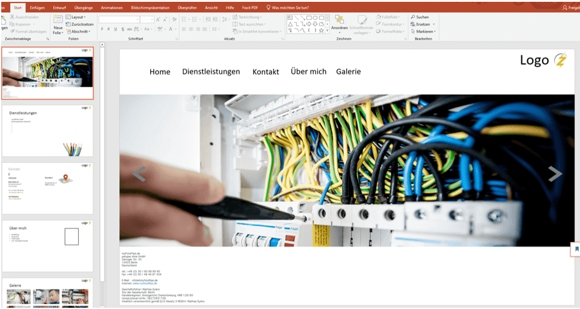

+++
title = "Vorlage für Webseite"
date = "2021-09-14"
draft = false
pinned = false
image = "vorlage.png"
description = "Für unseren Kunde haben wir eine PowerPoint gestaltet, die wie die Webseite aufgebaut ist, damit er einen Einblick hat, wie die Homepage aussehen könnte. "
+++
Die PowerPoint Folien sind aufgebaut, wie die Webseite nachher aussehen könnte. Die verschiedenen Rubriken sind zu sehen, sowie die Gestaltungsrichtung. Diese PowerPoint hilft sowohl unserem Kunden, weil dieser so die verschiedenen Möglichkeiten sieht, wie auch die stylische Richtung. Anhand dieser Folien kann uns der Kunde sagen, was ihm gefällt und was er nicht so möchte. Auch für uns hat diese Art Skizze der Webseite grosse Vorteile, wir haben damit eine Art Vorlage, die uns hilft die Wünsche des Kunden zu präzisieren und auch zu erkennen, ob sie den Vorstellungen und dem Geschmack des Kunden entsprechen. Ausserdem finden wir so heraus, was für Angaben, Texte und Bilder uns noch fehlen. Wir haben zu den Rubriken Home, Dienstleistungen, Über mich, Galerie und Kontakt je eine Folie kreiert mit Bildern und Feldern. Das Ziel wäre die Bilder und Texte durch die des Kunden zu ersetzen, die jetzigen sind nur provisorisch und sollen die Vorstellungskraft unterstützen. 

